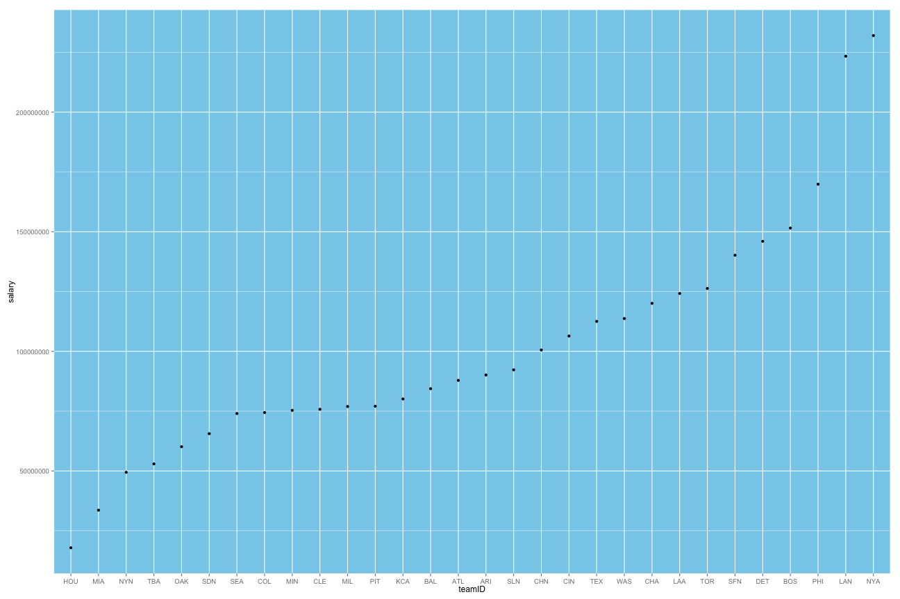

MLB Salary Report
========================================================
author: Tsung-Hsien Lin 
date: Aug.24.2014
width: 1440
height: 960

Introduction
========================================================

In this slides, you'll know how to use shiny to build a simple application to generate MLB Salary Report

- Data Source
- UI
- Server
- Application

Data Source
================
The data source is from:
http://www.seanlahman.com/baseball-archive/statistics/

We load Salaries.csv into R to generate Report 

UI
========================================================
The report provides all salaries of each team between 2006 to 2013. We need two selectInput widgets: one is for selecting year, another one is for choosing the ordering of salary.
To generate the report, we use plotOutput to create the plot from server.R

```r
library(shiny)
all_team_history_salary <- read.csv("lahman-csv_2014-02-14/Salaries.csv")

    column(4, 
             selectInput("yearID", 
                         "Year:", 
                         sort(unique(as.character(all_team_history_salary$yearID)),decreasing = TRUE))
      )
),
    column(4, 
             selectInput("order", 
                         "Order By:", 
                         c("ASC","DES"))
      ) 
    ),
    # Create a new row for the Plot
    fluidRow(
      plotOutput("plot")
    ) 
```


Server
========================================================

In server.R, we clean the data and aggregate salary for each team

```r
shinyServer(function(input, output) {
  
  # Filter data based on selections
  output$plot <- renderPlot({
    all_team_history_salary <- read.csv("lahman-csv_2014-02-14/Salaries.csv")
    all_team_history_salary <- all_team_history_salary[all_team_history_salary$yearID == input$yearID, c("yearID", "teamID", "salary")]
    team_salary <- aggregate(salary ~ teamID, all_team_history_salary,sum)
    if(input$order =="ASC"){
      team_salary<-with(team_salary, team_salary[order(salary),])
    }
    else{
      team_salary<-with(team_salary, team_salary[order(-salary),])
    }
    labels <- team_salary$teamID
    team_salary$teamID <- factor(team_salary$teamID, levels=labels)
    ggplot(data=team_salary, aes(teamID, salary)) + geom_point() + theme(panel.background = element_rect(fill = 'skyblue'))
  })
})
```

Application
========
Assuming our input year is 2013. We'll generate the following plot by the application
 
